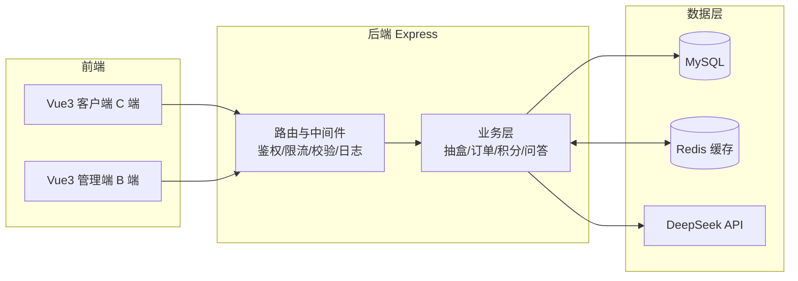
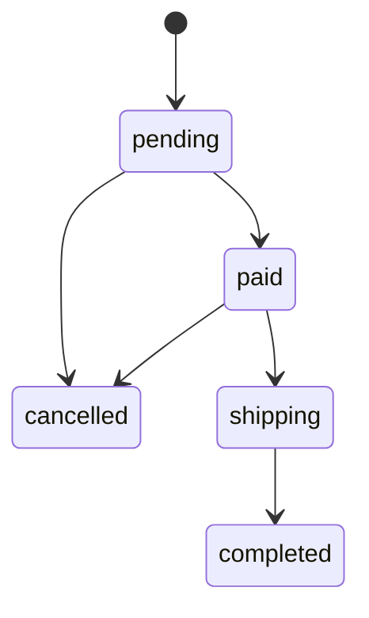

<div align="center">

# 🎁 盲盒星球 · 盲盒商城信息管理系统

**Vue 3 + Node.js(Express) + MySQL 打造的现代化盲盒商城，含 C 端商城、B 端管理后台与 AI 智能问答**

[](https://vuejs.org/)
[](https://www.typescriptlang.org/)
[](https://vitejs.dev/)
[](https://element-plus.org/)
[](https://expressjs.com/)
[](https://www.mysql.com/)
[](https://redis.io/)
[](https://jwt.io/)
[](./LICENSE)

</div>

## 📖 项目简介

盲盒星球是一个集 **盲盒抽取、积分商城、订单交易、智能问答** 于一体的完整盲盒电商系统，同时提供面向普通用户的客户端（C 端）与面向运营/管理人员的管理端（B 端）。

项目由本人担任**项目负责人（开发与测试）**，独立完成需求分析、系统设计、前后端开发与质量保障工作。除核心业务实现外，还围绕业务接入 **Redis 商品缓存** 与 **DeepSeek 智能问答（轻量级 RAG）**，并配套 **接口 / UI 自动化测试方案** 以提升版本回归效率。

- 📦 **完整商城闭环**：盲盒 → 抽取 → 盒柜 → 发货/回收 → 订单 → 积分/优惠券
- 🧠 **智能化**：Redis 多级缓存 + 基于商城知识库的检索增强问答（RAG）
- 🛡️ **质量保障**：事务一致性、并发安全抽盒、自动化测试与冒烟脚本

---

## ✨ 功能特性

### 客户端（C 端）

| 模块 | 说明 |
| --- | --- |
| 🏠 首页 | 轮播图、分类导航、热门盲盒、中奖播报 |
| 🔍 发现页 | 分类筛选、排序、商品瀑布流 |
| 🎲 盲盒详情 | 奖池展示、单抽 / 五连 / 十连、开盒动画 |
| 🗄️ 盒柜 | 奖品管理、发货申请、回收 |
| 👤 个人中心 | 用户资产、订单、优惠券、签到、智能问答入口 |
| 🎫 积分商城 | 商品兑换、优惠券兑换 |
| 🔎 搜索 | 关键词搜索、历史记录、热门搜索 |
| 📦 订单 | 订单列表、订单详情、收货地址 |
| 💰 充值 | 盲盒币充值 |
| 🔐 登录注册 | JWT 认证、密码加密 |

### 管理端（B 端）

| 模块 | 说明 |
| --- | --- |
| 📊 数据大盘 | 核心指标、转化漏斗、销售趋势、奖池监控 |
| 🎁 盲盒管理 | 盲盒 CRUD、奖池配置、上下架 |
| 🏷️ 分类管理 | 分类 CRUD、排序 |
| 🏆 奖品管理 | 奖品 CRUD、关联盲盒、库存管理 |
| 📦 订单管理 | 订单列表、详情、发货、取消 |
| 👥 用户管理 | 用户列表、权限管理、批量操作 |
| 💹 营收报表 | 营收趋势、数据明细 |
| ⚙️ 系统设置 | 系统参数配置 |

### 智能化 & 质量保障

- ⚡ **Redis 商品缓存**：查询未命中回源 MySQL，命中直返；商品变更/交易提交后精准失效（版本号机制），故障自动降级回源
- 🧠 **DeepSeek 智能问答**：商城助手（检索知识库 + 在售商品，输出参考资料）+ 通用问答（最近 5 轮上下文），支持提问限流与并发控制
- 🧪 **自动化测试**：Redis 缓存专项用例（命中、写后失效、并发加载、故障回源）+ AI 问答参数校验 + 接口冒烟脚本（角色权限、缓存响应、参数校验）

---

## 🛠️ 技术栈

| 分类 | 技术 | 版本 |
| --- | --- | --- |
| 前端框架 | Vue | 3.5.13 |
| 前端语言 | TypeScript | 5.6.2 |
| UI 组件库 | Element Plus | 2.8.4 |
| 状态管理 | Pinia | 2.3.0 |
| 路由管理 | Vue Router | 4.4.5 |
| 构建工具 | Vite | 6.4.2 |
| 后端框架 | Express | 4.19.2 |
| 数据库 | MySQL | 5.7+ |
| ORM 框架 | Sequelize | 6.37.0 |
| 缓存 | Redis | 6.x |
| 认证方式 | JWT | 9.0.2 |
| 密码加密 | bcryptjs | 2.4.3 |
| 实时通信 | Socket.io | 4.8.3 |
| 参数校验 | express-validator | 7.2.0 |
| 文件上传 | multer | 1.4.5 |

## 🏗️ 系统架构



---

## 🎲 核心算法与设计

### 1. 抽盒算法（独立概率模型）

- **独立概率**：每个奖品独立按自身概率判定
- **支持抽空**：允许抽不到任何奖品
- **库存控制**：库存为 0 的奖品无法被抽中
- **保底机制**：五连抽必出稀有及以上，十连抽双保底
- **并发安全**：数据库事务 + 行锁（`SELECT ... FOR UPDATE`）

| 抽盒类型 | 保底机制 |
| --- | --- |
| 单抽 | 无保底 |
| 五连抽 | 至少 1 个稀有及以上 |
| 十连抽 | 至少 2 个稀有及以上 |

### 2. 订单状态机



### 3. Redis 商品缓存

- 查询未命中时访问 MySQL，并写入带 TTL 的 Redis 缓存；命中直接返回。
- 商品、分类、奖品变更以及抽盒、购买、积分兑换成功后，采用**版本号机制**使相应缓存失效，避免旧数据回写。
- Redis 故障时**自动回源 MySQL**；管理后台可查看命中率、降级次数与连接状态并手动刷新。

### 4. 智能问答（轻量级 RAG）

- 商城助手基于 `server/knowledge/mall.json` 知识库与在售商品快照进行**中文双字片段 + 英文词匹配**检索，将最多 4 条规则 + 4 条商品资料与上下文一起送入 DeepSeek 回答，并展示参考资料。
- 通用问答不读取商城数据，支持最近 5 轮上下文；两种模式切换即开始新对话。
- 内置密钥管理、登录鉴权、输入校验、提问限流、并发限制、上游超时与错误提示。

> 详细的缓存与问答设计（键结构、TTL 策略、失效时机、限流规格、API 契约）见 [Redis与智能问答设计.md](./Redis与智能问答设计.md)。

---

## 🧪 质量保障与测试

| 类型 | 工具 / 方式 | 覆盖内容 |
| --- | --- | --- |
| 单元/集成测试 | Node 原生测试器（`node --test`） | Redis 缓存命中、写后失效、并发加载、故障回源；AI 问答参数校验 |
| 接口冒烟 | `scripts/smoke-features.js` | 角色权限、缓存响应头、问答参数校验（只读数据库，不产生脏数据） |
| 数据校验 | SQL | 结合数据库校验接口响应与业务数据一致性 |

> 说明：以上为仓库内已落地的自动化测试资产。此外本项目的质量保障方案还包括 **Pytest + Requests 接口自动化**（鉴权 Fixture、YAML 参数化、公共断言）与 **Playwright UI 自动化**（核心流程回归），用于版本回归与冒烟。

运行方式：

```bash
# 后端：单元/集成测试（覆盖 Redis 缓存与 AI 问答）
cd server && npm test

# 后端：接口冒烟脚本（需已运行 MySQL、Redis 及正常账号数据）
npm run smoke:features

# 前端：构建校验
cd ../client && npm run build
```

> 自动测试使用独立随机 Redis 前缀，结束时仅清理该前缀；Redis 未启动时明确跳过真实缓存测试。

---

## 🚀 快速开始

### 1. 环境要求

- Node.js >= 18.x
- MySQL >= 5.7
- （可选）Redis 6.x，用于缓存与问答限流

### 2. 数据库准备

```sql
CREATE DATABASE blind_box_mall DEFAULT CHARACTER SET utf8mb4 COLLATE utf8mb4_unicode_ci;
```

### 3. 配置环境变量

复制 `server/.env.example` 为 `server/.env`，并按需填写：

```env
DB_HOST=localhost
DB_PORT=3306
DB_NAME=blind_box_mall
DB_USER=root
DB_PASS=your_password
JWT_SECRET=your_secret_key_here
PORT=8080

# Redis（可选，不使用缓存可关闭）
REDIS_URL=redis://127.0.0.1:6379
REDIS_CACHE_ENABLED=true

# DeepSeek 智能问答（可选）
AI_ENABLED=true
DEEPSEEK_API_KEY=your_api_key
DEEPSEEK_BASE_URL=https://api.deepseek.com
DEEPSEEK_MODEL=deepseek-flash
```

### 4. 安装依赖

```bash
# 后端
cd server && npm install

# 前端
cd client && npm install
```

### 5. 初始化数据

```bash
cd server && node seeders/seed.js
```

### 6. 启动项目

```bash
# 后端开发服务器（端口 8080）
cd server && npm run dev

# 前端开发服务器（端口 3000）
cd client && npm run dev
```

### 7. 访问地址

- 客户端：http://localhost:3000
- 管理端：http://localhost:3000/admin
- 智能问答：http://localhost:3000/assistant
- 缓存管理：http://localhost:3000/admin/cache

### 8. 测试账号

| 角色 | 邮箱 | 密码 |
| --- | --- | --- |
| 管理员 | admin@blindbox.com | admin123 |
| 普通用户 | user@blindbox.com | user123 |

---

## 📁 项目结构

```
new_shop/
├── client/                    # 前端项目（Vue3 + TS）
│   ├── src/
│   │   ├── components/        # 可复用组件
│   │   ├── router/            # 路由配置
│   │   ├── services/          # API 请求封装 / WebSocket
│   │   ├── stores/            # Pinia 状态管理
│   │   ├── utils/             # 工具函数
│   │   ├── views/             # C 端页面
│   │   ├── views/admin/       # B 端管理页面
│   │   ├── App.vue            # 根组件
│   │   └── main.ts            # 入口文件
│   └── vite.config.ts
├── server/                    # 后端项目（Express + Sequelize）
│   ├── config/                # 数据库 / Redis 连接配置、建表
│   ├── models/                # Sequelize 数据模型（用户/盲盒/奖品/订单等）
│   ├── routes/                # API 路由（认证/盲盒/订单/积分/分类/签到/大盘等）
│   ├── middleware/            # 中间件（JWT 鉴权/参数校验/日志/限流防刷/AI 限流）
│   ├── services/              # 业务服务（AI 问答/知识库检索）
│   ├── utils/                 # 抽盒算法 / 缓存 / WebSocket
│   ├── knowledge/             # 商城知识库（mall.json）
│   ├── test/                  # 自动化测试（Redis 缓存 / AI 问答）
│   ├── scripts/               # 冒烟脚本 / Redis 启动脚本
│   ├── seeders/               # 数据初始化 / 清空
│   ├── index.js               # 入口文件
│   └── package.json
├── API接口文档.md             # 接口文档
├── Redis与智能问答设计.md      # 缓存与问答设计说明
└── README.md
```

---

## 📡 API 接口概览

完整接口约定见 [API接口文档.md](./API接口文档.md)。接口统一返回 `{ code, data, message }` 格式。

### 认证

| 方法 | 路径 | 描述 |
| --- | --- | --- |
| POST | /api/auth/register | 用户注册 |
| POST | /api/auth/login | 用户登录 |

### 盲盒

| 方法 | 路径 | 描述 |
| --- | --- | --- |
| GET | /api/blind-boxes | 获取盲盒列表 |
| GET | /api/blind-boxes/:id | 获取盲盒详情 |
| POST | /api/blind-boxes/:id/draw | 抽盒（单抽/五连/十连） |

### 积分 & 订单

| 方法 | 路径 | 描述 |
| --- | --- | --- |
| GET | /api/points | 获取积分商品列表 |
| POST | /api/points/exchange | 积分兑换 |
| GET | /api/orders | 我的订单列表 |
| GET | /api/orders/:id | 订单详情 |

### 缓存 & 智能问答

| 方法 | 路径 | 权限 | 描述 |
| --- | --- | --- | --- |
| GET | /api/cache/status | 管理员 | Redis 状态、命中率、覆盖模块 |
| DELETE | /api/cache | 管理员 | 使商品缓存模块失效 |
| GET | /api/ai/status | 公开 | 问答功能与模型配置状态 |
| POST | /api/ai/chat | 已登录 | 提问（商城助手 / 通用问答） |

---

## 🔒 安全措施

- 密码 bcrypt 加密存储
- JWT Token 认证
- 请求限流防刷（120 次/分钟）+ AI 提问限流
- 角色权限控制（user / admin）
- 参数校验（express-validator）
- SQL 注入防护（Sequelize ORM 参数化）
- 数据库事务保证数据一致性
- 密钥仅存服务端，不落前端 / 源码 / 接口返回

---

## 📝 更新日志

### v2.0.0（2026-06）

- 新增积分商城、优惠券、我的订单、签到功能
- 实现开盒动画与独立概率抽盒算法
- 实现五连抽 / 十连抽保底机制
- 接入 Redis 商品缓存与缓存管理页面
- 接入 DeepSeek 智能问答（商城助手 / 通用问答）
- 新增缓存与问答自动化测试、接口冒烟脚本
- 修复图片显示、分类筛选、抽盒服务器错误、订单页空白等问题

### v1.0.0（2026-05）

- 初始版本，基础盲盒商城功能

---

## 📄 许可证

[MIT License](./LICENSE)

---

<div align="center">
  <sub>Built with ❤️ using Vue 3 & Express · 盲盒星球商城系统</sub>
</div>