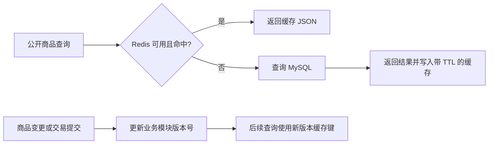
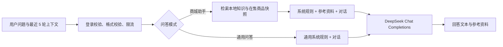

# Redis 缓存与 DeepSeek 智能问答

## 已实现功能

- 商品查询 Redis 缓存：查询未命中时访问 MySQL，再写入 Redis；命中时直接返回。
- 商品、分类、奖品变更，以及抽盒、周边购买、积分兑换成功后，使相关缓存失效。
- Redis 故障时回退 MySQL；管理员可查看命中率、降级次数和连接状态，并手动刷新缓存。
- 商城助手：检索商城知识库与部分在售商品资料，调用 DeepSeek 回答，展示参考资料。
- 通用问答：不读取商城数据，支持最近 5 轮上下文，切换模式会开始新对话。
- 后端密钥管理、登录鉴权、输入校验、提问限流、并发限制、上游超时及错误提示。

## 使用入口

- 前端 `http://localhost:3000/assistant`：登录后使用，两种模式可切换。
- 后台 `http://localhost:3000/admin/cache`：管理员查看缓存与模型配置状态。
- 商城悬浮按钮和个人中心均提供“智能问答”入口。

## 本机启动

`npm install redis` 安装的是 Node.js 客户端库。Redis 服务端需要单独启动。

本机已找到 `D:\ZenTao\bin\redis\redis-server.exe`（6.2.16）。项目启动脚本复用该可执行文件，使用本项目独立配置和目录，不启动禅道服务或加载禅道数据：

```powershell
cd D:\bigkes\new_shop\server
.\scripts\start-redis.ps1 -RedisServer 'D:\ZenTao\bin\redis\redis-server.exe'
```

其他机器将参数换成自己的 Redis 程序路径。也可连接已有 Redis 服务，修改 `server/.env` 的 `REDIS_URL`。本地实例仅绑定 `127.0.0.1:6379`，最多使用 128 MB 内存，不保存缓存到磁盘。运行目录和日志位于 `server/.runtime/redis`，已加入 Git 忽略。

避免重复运行启动脚本；若端口占用，查看日志并确认原实例。可使用 Redis 自带的客户端执行 `redis-cli -h 127.0.0.1 -p 6379 ping`，正常返回 `PONG`。

配置 `server/.env`（已存在的数据库和 JWT 配置请保留）：

```dotenv
REDIS_URL=redis://127.0.0.1:6379
REDIS_CACHE_ENABLED=true
REDIS_KEY_PREFIX=blindbox:
REDIS_DEFAULT_TTL=60
REDIS_TIMEOUT_MS=500
REDIS_RETRY_INTERVAL_MS=15000

AI_ENABLED=true
DEEPSEEK_API_KEY=在本机填写你的密钥
DEEPSEEK_BASE_URL=https://api.deepseek.com
DEEPSEEK_MODEL=deepseek-flash
AI_TIMEOUT_MS=45000
AI_MAX_TOKENS=1500
AI_RATE_LIMIT=10
AI_GLOBAL_RATE_LIMIT=60
AI_MAX_CONCURRENT=4
```

`deepseek-flash` 是实现时官方文档提供的模型标识，可通过配置替换为账号可用的模型。使用非思考模式，避免普通问答等待较长。密钥不会发给浏览器、写入源码或通过状态接口返回。修改 `.env` 后重启后端。

分别启动前后端：

```powershell
# 后端：已有数据库时，避免启动期间自动修改表结构
cd D:\bigkes\new_shop\server
$env:DB_SYNC = 'false'
npm run dev
```

```powershell
# 另一个终端
cd D:\bigkes\new_shop\client
npm run dev
```

此次新增功能不需要数据库迁移。原来的首次建表/初始化流程仍可使用。

## 缓存设计



| 命名空间 | 查询范围 | TTL 上限 | 失效时机 |
| --- | --- | --- | --- |
| `blind-boxes` | 列表、热门、新品、分类、无限盲盒、详情、问答商品资料 | 默认 60 秒；热门/问答 30 秒；详情 15 秒 | 盲盒或奖品增删改、抽盒提交、分类变更 |
| `categories` | 公开分类列表 | 300 秒 | 分类增删改 |
| `hot-products` | 周边列表、详情、问答商品资料 | 默认 60 秒；详情/问答 30 秒 | 商品增删改、购买提交 |
| `points` | 积分商品列表和详情 | 30 秒 | 积分兑换提交 |

实际 TTL 为配置的 90%～100%，通过随机错开过期时间减少同时回源。订单、账户余额、个人盒柜等私有数据和鉴权结果不进入共享缓存；交易仍直接查询 MySQL。

键结构：

```text
blindbox:cache:version:<业务模块>                 # 随机版本号
blindbox:cache:data:<业务模块>:<版本>:<SHA256>     # 响应 JSON，有 TTL
blindbox:ai:limit:user:<用户 ID>                 # 提问次数，60 秒过期
blindbox:ai:limit:global                         # 全局提问次数，60 秒过期
```

查询参数先排序再生成哈希，同一请求不受参数顺序影响。成功响应才缓存，错误响应不缓存，超过 1 MB 的响应跳过写入。

使用版本号失效，避免“旧查询晚于写事务结束，把旧数据重新写回当前缓存”。修改完成或事务提交后更新版本号，之后的请求只能读到新版本；旧键由 TTL 回收。手动刷新不执行 `FLUSHDB`，不会清除 AI 限流或其他应用数据。

连接与命令默认 500 ms 超时，连接失败后 15 秒内不重复尝试连接；禁用离线命令排队。Redis 恢复后下一次到期重试可自动连接。缓存失效在 Redis 故障时是尽力而为：如果故障期间修改了数据库，恢复后旧缓存最多仍可存在原 TTL；严格一致的价格、余额和库存校验应始终在数据库事务中执行。

问答商品资料的并发读取在单个 Node.js 进程内合并。普通列表接口不使用分布式互斥锁。后台计数是当前 Node.js 进程自启动以来的统计，非全实例聚合。

## 问答设计



商城知识库在 `server/knowledge/mall.json`，维护每条资料的标题、关键词、内容和页面路径。检索采用中文双字片段与英文词匹配，标题匹配权重更高；这是轻量检索增强问答，没有向量数据库或 Embedding 服务。

商品资料从 MySQL 读取公开字段，各取销量/抽取量靠前的最多 80 个在售盲盒及周边商品，再筛选最多 4 条相关商品。资料并非完整商品搜索结果。最多 4 条规则和 4 条商品传给模型，前端展示的“参考资料”表示本次提供给模型的资料，不保证模型实际引用了每一条。

通用模式不读取商城商品或个人数据。系统没有联网搜索能力，也没有让模型执行下单、充值、回收或发货的工具。商城规则缺失时提示确认，商品查询故障时仍可根据本地规则回答，并在页面标明资料不可用。

每个用户默认每分钟最多 10 次，全站默认每分钟 60 次；Redis 使用 Lua 原子计数，故障时使用本进程内存计数。每个用户同一进程仅允许一个请求，单进程最多 4 个并发请求。多进程部署时限流正常情况下通过 Redis 共享，但并发上限以及故障降级计数仍按进程计算。

单个问题最多 2000 字，历史最多 5 轮、总输入最多 24000 字。客户端只能提交交替的 `user` / `assistant` 消息，系统指令由服务端生成。浏览器使用文本插值呈现回答，不把模型输出当 HTML 执行。会话仅留在页面内存；最多展示 30 轮，刷新清空。商城与通用模式切换会清空当前会话。

## API

所有接口沿用 `{ code, data, message }` 格式。

| 方法 | 路径 | 权限 | 用途 |
| --- | --- | --- | --- |
| GET | `/api/cache/status` | 管理员 | Redis 状态、命中率、计数、覆盖模块 |
| DELETE | `/api/cache` | 管理员 | 使四个商品缓存模块失效 |
| GET | `/api/ai/status` | 公开 | 功能是否启用、是否配置密钥、模型名 |
| POST | `/api/ai/chat` | 已登录 | 提问，成功返回回答及参考资料 |

提问示例：

```json
{
  "mode": "mall",
  "message": "积分怎么获得？",
  "history": []
}
```

`mode` 为 `mall` 或 `general`；`history` 为完整的历史问答对，当前问题单独放在 `message`。响应 `data` 包含 `answer`、`model`、`mode`、`sources`、`truncated`、`catalogAvailable`。

缓存查询响应头 `X-Cache` 为 `MISS`、`HIT` 或 `BYPASS`。AI 常见状态：400 参数错误、401 未登录、429 限流/繁忙、502 上游错误、503 未配置/认证失败/余额不足、504 超时。

## 验证与演示

```powershell
cd D:\bigkes\new_shop\server
npm test
# 需要已运行 MySQL、Redis，且数据库中已有正常管理员和普通用户
npm run smoke:features
# 额外发出两次真实 DeepSeek 请求，会消耗模型额度
npm run smoke:features -- --ai

cd D:\bigkes\new_shop\client
npm run build
```

自动测试使用独立随机 Redis 前缀，结束时只清理该测试前缀；Redis 未启动时明确跳过真实缓存测试。可通过 `TEST_REDIS_URL` 指向测试实例。接口联调脚本只读取现有数据库，不创建订单、不扣款、不修改数据库；会刷新本应用缓存。

演示步骤：打开后台状态页 → 连续访问发现页 → 刷新状态查看命中次数 → 修改一个商品后重新查询，或点击刷新缓存 → 使用商城助手询问商品与积分规则，查看资料 → 切换通用问答，连续追问。

实现时已验证：14 项自动测试通过，前端完整构建通过；真实 MySQL + Redis 四个模块命中、管理员权限和问答校验通过；DeepSeek 连续上下文问答及带实际商品资料的商城问答均返回成功。浏览器验证了提问、回答与资料展示、390 像素移动视口无横向溢出，以及管理员状态页加载。

## 官方参考

- [Redis Node.js 生产使用与故障处理](https://redis.io/docs/latest/develop/clients/nodejs/produsage/)
- [DeepSeek Chat Completions API](https://api-docs.deepseek.com/api/create-chat-completion/)
- [DeepSeek 多轮对话](https://api-docs.deepseek.com/guides/multi_round_chat/)
